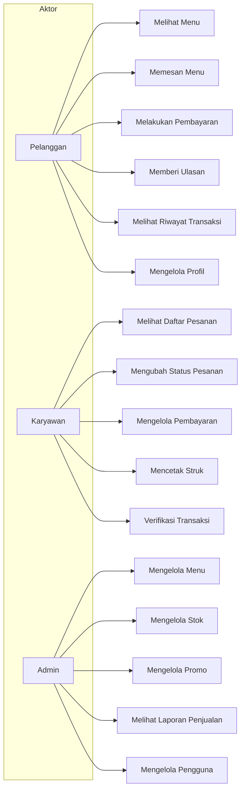
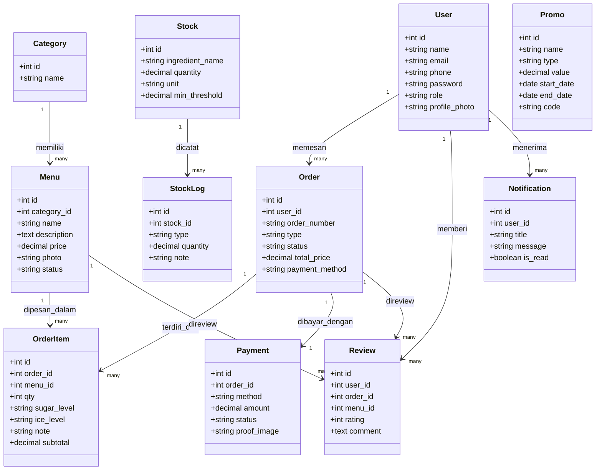
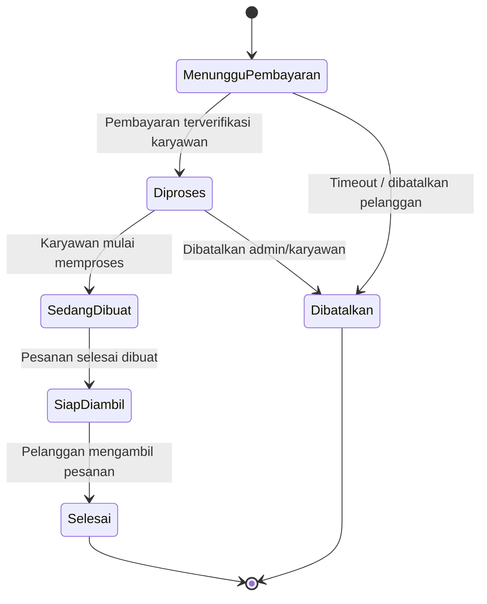
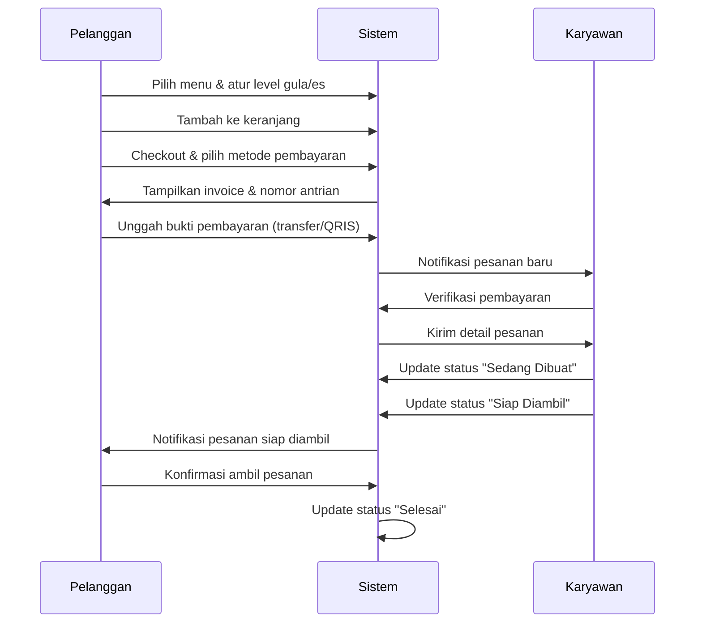

# Product Requirements Document (PRD)
# KOTE SCHOOL SHOP

**Versi:** 1.0
**Tipe Aplikasi:** Web (MVP), pengembangan lanjutan ke Android
**Stack:** Laravel (Backend + Blade), Tailwind CSS (Styling), JavaScript vanilla (Interaktivitas), MySQL (Database)

---

## 1. Ringkasan Produk

KOTE SCHOOL SHOP adalah aplikasi pemesanan makanan dan minuman berbasis web yang membantu pelanggan memesan menu secara praktis, sekaligus membantu pemilik coffee shop mengelola menu, pesanan, pembayaran, stok bahan baku, hingga laporan penjualan dalam satu sistem terintegrasi.

Aplikasi ini dibangun dengan pendekatan MVP (Minimum Viable Product) menggunakan Laravel sebagai backend, Blade + Tailwind CSS untuk tampilan, dan JavaScript vanilla untuk interaksi dinamis (tanpa framework JS tambahan di tahap awal).

---

## 2. Latar Belakang & Tujuan

### Tujuan Produk
- Mempermudah pelanggan dalam melakukan pemesanan.
- Mempercepat proses pelayanan di coffee shop.
- Mengurangi kesalahan pencatatan pesanan.
- Membantu pengelolaan stok bahan baku.
- Mempermudah transaksi pembayaran.
- Menyediakan laporan penjualan secara otomatis.
- Meningkatkan kepuasan pelanggan.

### Masalah yang Diselesaikan
- Antrean pelanggan yang panjang.
- Kesalahan pencatatan pesanan secara manual.
- Sulit mengetahui stok bahan yang tersedia secara real-time.
- Rekap penjualan yang masih dilakukan manual.
- Pelanggan tidak tahu status pesanan mereka.
- Tidak ada riwayat transaksi pelanggan yang tersimpan rapi.

---

## 3. Definisi Pengguna & Role

| Role | Deskripsi Akses |
|---|---|
| **Pelanggan** | Melihat menu, memesan, membayar, memberi ulasan, melihat riwayat transaksi |
| **Karyawan** | Menggabungkan tugas kasir & barista: melihat daftar pesanan masuk, mengubah status pesanan (diproses → sedang dibuat → siap diambil), mengelola & memverifikasi pembayaran, mencetak struk digital |
| **Admin** | Mengelola menu, stok, promo, laporan, dan seluruh data sistem |

Role disimpan sebagai kolom `role` (enum) pada tabel `users` agar struktur tetap sederhana di tahap MVP.

---

## 4. Functional Requirements

### 4.1 Login & Registrasi
- Sistem harus menyediakan registrasi dan login terpisah untuk pelanggan, admin, dan karyawan.
- Sistem harus menyediakan fitur lupa password (reset via email).
- Password disimpan dalam bentuk hash (bcrypt, default Laravel).

### 4.2 Profil Pengguna
- Edit profil dan ganti foto profil.
- Ubah password.
- Lihat riwayat transaksi.
- Menandai menu favorit.

### 4.3 Daftar Menu
- Menu dikelompokkan berdasarkan kategori (Coffee, Non Coffee).
- Setiap menu memiliki foto, harga, deskripsi, dan status (tersedia/habis).

### 4.4 Detail Produk
- Pelanggan dapat memilih level gula dan level es.
- Pelanggan dapat menambahkan catatan khusus per item.

### 4.5 Keranjang Belanja
- Tambah, edit jumlah, dan hapus pesanan dalam keranjang.
- Total harga dihitung otomatis.
- Sistem menampilkan estimasi waktu pembuatan pesanan.

### 4.6 Pemesanan
- Tipe pemesanan: Pesan di Tempat, Take Away, Pre Order.
- Sistem menghasilkan nomor antrian otomatis untuk setiap pesanan.

### 4.7 Pembayaran
- Metode pembayaran: Tunai, QRIS, Transfer Bank, E-Wallet.
- Pelanggan dapat mengunggah bukti pembayaran.
- Sistem mencetak/menampilkan struk digital.

### 4.8 Status Pesanan
Status yang didukung: `Menunggu Pembayaran`, `Diproses`, `Sedang Dibuat`, `Siap Diambil`, `Selesai`, `Dibatalkan`. (Lihat diagram status di bagian 6.3)

### 4.9 Notifikasi
- Notifikasi pesanan diterima, pembayaran berhasil, pesanan sedang dibuat/siap diambil, dan promo terbaru.

### 4.10 Manajemen Menu (Admin)
- CRUD menu: tambah, edit, hapus, upload foto, atur harga, atur status stok.

### 4.11 Manajemen Stok
- Data bahan baku, pencatatan stok masuk/keluar.
- Peringatan otomatis saat stok menipis (di bawah ambang batas minimum).
- Riwayat penggunaan bahan baku.

### 4.12 Promo & Voucher
- Jenis promo: diskon, voucher, buy 1 get 1, promo hari tertentu, cashback.

### 4.13 Rating & Review
- Pelanggan dapat memberi bintang dan ulasan per menu/pesanan.
- Pelanggan dapat melihat ulasan dari pelanggan lain.

### 4.14 Riwayat Pesanan
- Riwayat pembelian, detail transaksi, download struk, pesan ulang menu favorit.

### 4.15 Dashboard Admin
- Total penjualan, jumlah pesanan, produk terlaris, pendapatan harian/bulanan, grafik penjualan.

### 4.16 Laporan
- Laporan penjualan harian, mingguan, bulanan, tahunan.
- Export ke PDF dan Excel.

### 4.17 Pencarian & Filter
- Cari menu, kategori, promo.
- Filter berdasarkan harga dan menu favorit.

### 4.18 Keamanan
- Role-based access control (middleware Laravel per role).
- Password terenkripsi.
- Logout otomatis (session timeout).
- Backup database berkala.

---

## 5. Non-Functional Requirements

| Aspek | Ketentuan |
|---|---|
| **Performa** | Halaman utama dan proses checkout harus merespons di bawah 2 detik pada kondisi jaringan normal |
| **Keamanan** | Autentikasi via Laravel Auth/Sanctum, password hashing, validasi input di setiap form |
| **Skalabilitas** | Struktur database dirancang agar mudah menambah cabang toko di masa depan |
| **Usability** | Tampilan responsif (mobile-first) menggunakan Tailwind CSS |
| **Maintainability** | Mengikuti struktur MVC Laravel standar agar mudah dikembangkan tim |
| **Reliability** | Backup database otomatis harian |

---

## 6. UML Diagram

### 6.1 Use Case Diagram

### 6.2 Class Diagram (Domain Model)

### 6.3 State Diagram — Status Pesanan

### 6.4 Sequence Diagram — Proses Order & Pembayaran

---

## 7. Rancangan Database

| Tabel | Field Utama | Keterangan |
|---|---|---|
| `users` | id, name, email, phone, password, role, profile_photo | Menyimpan semua role (pelanggan/admin/karyawan) |
| `categories` | id, name | Coffee, Non Coffee, dst |
| `menus` | id, category_id, name, description, price, photo, status | Status: tersedia/habis |
| `orders` | id, user_id, order_number, type, status, total_price, payment_method | Type: dine_in/take_away/pre_order |
| `order_items` | id, order_id, menu_id, qty, sugar_level, ice_level, note, subtotal | Detail item per pesanan |
| `payments` | id, order_id, method, amount, status, proof_image, paid_at | Bukti & status pembayaran |
| `stocks` | id, ingredient_name, quantity, unit, min_threshold | Data bahan baku |
| `stock_logs` | id, stock_id, type (masuk/keluar), quantity, note | Riwayat pemakaian stok |
| `promos` | id, name, type, value, start_date, end_date, code | Diskon/voucher/BOGO/cashback |
| `reviews` | id, user_id, order_id, menu_id, rating, comment | Rating & ulasan |
| `notifications` | id, user_id, title, message, is_read | Notifikasi in-app |

Catatan: keranjang belanja (cart) tidak memerlukan tabel permanen di tahap MVP, cukup disimpan di session/local state sebelum checkout menjadi `order`.

---

## 8. Struktur Teknis (Laravel)

**Models:** User, Category, Menu, Order, OrderItem, Payment, Stock, StockLog, Promo, Review, Notification

**Controllers (garis besar):**
- `AuthController` — login, registrasi, lupa password
- `MenuController` — CRUD menu (admin), listing menu (pelanggan)
- `CartController` — kelola keranjang (session-based)
- `OrderController` — checkout, tracking status pesanan
- `PaymentController` — proses & verifikasi pembayaran
- `StockController` — kelola stok bahan baku
- `PromoController` — kelola promo & voucher
- `ReviewController` — rating & ulasan
- `ReportController` — laporan penjualan + export PDF/Excel
- `DashboardController` — ringkasan data admin

**Frontend:**
- Blade template + Tailwind CSS untuk seluruh tampilan.
- JavaScript vanilla (fetch API) untuk interaksi tanpa reload: update keranjang, filter menu, update status pesanan real-time via polling sederhana (bisa upgrade ke WebSocket/Pusher di fase lanjutan).

---

## 9. Ruang Lingkup MVP

**Termasuk (Fase 1):**
- Login/registrasi seluruh role
- Manajemen menu & kategori
- Keranjang, checkout, pembayaran manual (upload bukti)
- Status pesanan & notifikasi dasar
- Manajemen stok
- Riwayat transaksi & review
- Dashboard & laporan dasar

**Di luar cakupan MVP (fase lanjutan):**
- Integrasi payment gateway otomatis (Midtrans/Xendit)
- Aplikasi Android native
- Real-time notification via WebSocket/Pusher
- Multi-cabang toko
